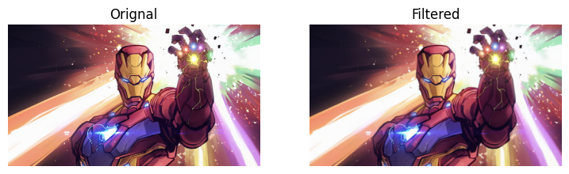
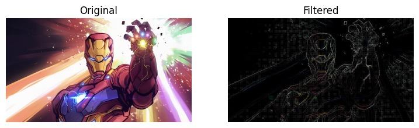

# Implementation-of-Filters
## Aim:
To implement filters for smoothing and sharpening the images in the spatial domain.

## Software Required:
Anaconda - Python 3.7

## Algorithm:
Step1
Import the necessary modules.

Step2
For performing smoothing operation on a image.

Average filter kernel=np.ones((11,11),np.float32)/121 image3=cv2.filter2D(image2,-1,kernel)
Weighted average filter kernel1=np.array([[1,2,1],[2,4,2],[1,2,1]])/16 image3=cv2.filter2D(image2,-1,kernel1)
Gaussian Blur gaussian_blur=cv2.GaussianBlur(image2,(33,33),0,0)
Median filter median=cv2.medianBlur(image2,13)

Step3
For performing sharpening on a image.

Laplacian Kernel kernel2=np.array([[-1,-1,-1],[2,-2,1],[2,1,-1]]) image3=cv2.filter2D(image2,-1,kernel2)
Laplacian Operator laplacian=cv2.Laplacian(image2,cv2.CV_64F)

Step4
Display all the images with their respective filters. 

## Program:
### Developed By   : Sarveshvaran.P
### Register Number: 212221230090
</br>

### 1. Smoothing Filters

i) Using Averaging Filter
```
import cv2
import numpy as np
import matplotlib.pyplot as plt
image1=cv2.imread('oo.jpg')
image2=cv2.cvtColor (image1,cv2.COLOR_BGR2RGB) 
kernel = np.ones ((11,11), np.float32)/121
image3=cv2.filter2D(image2,-1, kernel)
plt.figure(figsize = (9,9))
plt.subplot(1,2,1) 
plt.imshow(image2)
plt.title('Original') 
plt.axis('off')
plt.subplot(1,2,2)
plt.imshow(image3)
plt.title('Filtered')
plt.axis('off')


```
ii) Using Weighted Averaging Filter
```
import cv2
import numpy as np
import matplotlib.pyplot as plt
image1=cv2.imread('oo.jpg')
image2=cv2.cvtColor (image1,cv2.COLOR_BGR2RGB) 
kernal2 = np.array([[1,2,1],[2,4,2],[1,2,1]])/16 
image3 = cv2.filter2D(image2,-1,kernal2)
plt.figure(figsize = (9,9))
plt.subplot(1,2,1) 
plt.imshow(image2)
plt.title('Original') 
plt.axis('off')
plt.subplot(1,2,2)
plt.imshow(image3)
plt.title('Filtered')
plt.axis('off')


```
iii) Using Gaussian Filter
```
import cv2
import numpy as np
import matplotlib.pyplot as plt
image1=cv2.imread('oo.jpg')
image2=cv2.cvtColor (image1,cv2.COLOR_BGR2RGB) 
gaussian_blur=cv2.GaussianBlur(src=image2,ksize=(11,11),sigmaX=0,sigmaY=0)
image3 = cv2.filter2D(image2,-1,kernal2)
plt.figure(figsize = (9,9))
plt.subplot(1,2,1) 
plt.imshow(image2)
plt.title('Original') 
plt.axis('off')
plt.subplot(1,2,2)
plt.imshow(image3)
plt.title('Filtered')
plt.axis('off')


```

iv) Using Median Filter
```
import cv2
import numpy as np
import matplotlib.pyplot as plt
image1=cv2.imread('oo.jpg')
image2=cv2.cvtColor (image1,cv2.COLOR_BGR2RGB) 
median=cv2.medianBlur(src=image2, ksize=11)
image3 = cv2.filter2D(image2,-1,kernal2)
plt.figure(figsize = (9,9))
plt.subplot(1,2,1) 
plt.imshow(image2)
plt.title('Orignal') 
plt.axis('off')
plt.subplot(1,2,2)
plt.imshow(image3)
plt.title('Filtered')
plt.axis('off')


```

### 2. Sharpening Filters
i) Using Laplacian Kernal
```
import cv2
import numpy as np
import matplotlib.pyplot as plt
image1=cv2.imread('oo.jpg')
image2=cv2.cvtColor (image1,cv2.COLOR_BGR2RGB) 
kernel3=np.array([[0,1,0],[1,-4,1],[0,1,0]])
image3=cv2.filter2D(image2,-1, kernel3)
plt.figure(figsize = (9,9))
plt.subplot(1,2,1) 
plt.imshow(image2)
plt.title('Original') 
plt.axis('off')
plt.subplot(1,2,2)
plt.imshow(image3)
plt.title('Filtered')
plt.axis('off')


```
ii) Using Laplacian Operator
```Python
import cv2
import numpy as np
import matplotlib.pyplot as plt
image1=cv2.imread('oo.jpg')
image2=cv2.cvtColor (image1,cv2.COLOR_BGR2RGB) 
new_image = cv2.Laplacian(image2, cv2.CV_64F)
plt.figure(figsize = (9,9))
plt.subplot(1,2,1) 
plt.imshow(image2)
plt.title('Orignal') 
plt.axis('off')
plt.subplot(1,2,2)
plt.imshow(image3)
plt.title('Filtered')
plt.axis('off')


```

## OUTPUT:
### 1. Smoothing Filters
</br>

i) Using Averaging Filter


ii) Using Weighted Averaging Filter


iii) Using Gaussian Filter


iv) Using Median Filter


### 2. Sharpening Filters
</br>

i) Using Laplacian Kernal


ii) Using Laplacian Operator


## Result:
Thus the filters are designed for smoothing and sharpening the images in the spatial domain.
